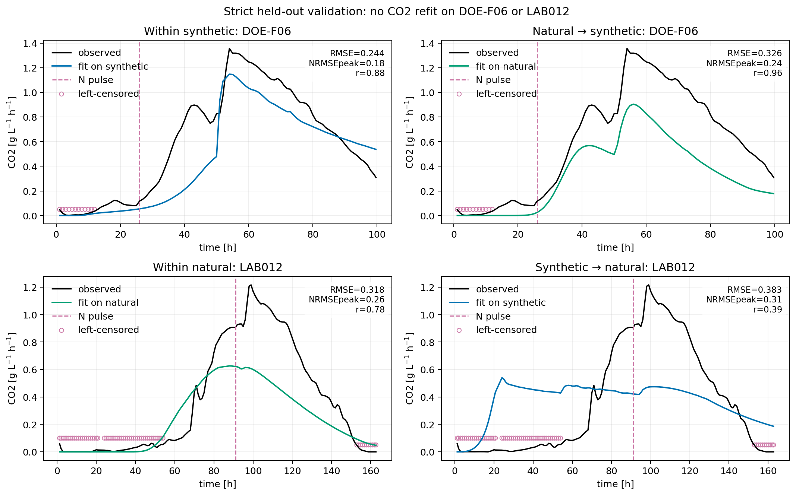

# Cómo se construyó el modelo de CO₂

## Alcance y fuentes

Este documento reconstruye el desarrollo del bloque de CO₂ a partir de tres notebooks y de los módulos que esos notebooks importan directamente:

1. [`pilot_2025/pilot_2025_co2_solubility_integrated_doe.ipynb`](fermentation_model/pilot_2025/pilot_2025_co2_solubility_integrated_doe.ipynb), en adelante **Piloto 2025**.
2. [`laboratory_2026/notebooks/co2_solubility_o2_cross_matrix_2026.ipynb`](fermentation_model/laboratory_2026/notebooks/co2_solubility_o2_cross_matrix_2026.ipynb), en adelante **Laboratorio 2026**.
3. [`pilot_2026/notebooks/pilot_2026_co2_solubility_cross_lot_validation.ipynb`](fermentation_model/pilot_2026/notebooks/pilot_2026_co2_solubility_cross_lot_validation.ipynb), en adelante **Piloto 2026**.

No se ejecutó nuevamente ninguno de ellos. Los valores numéricos provienen de sus outputs y de los CSV ya guardados. Para extraer las ecuaciones se inspeccionaron los módulos importados por esos notebooks, principalmente:

- `pilot_2025/run_pilot_2025_co2_solubility_integrated_doe.py`;
- `laboratory_2026/run_co2_matrix_cross_validation_2026.py`;
- `pilot_2026/run_co2_solubility_cross_lot_validation_2026.py`;
- el cálculo upstream importado de `shared/run_secondary_joint_campaign_doe.py`.

### Tres cantidades que no deben confundirse

- **Producción metabólica de CO₂**, (q_{bio}) o (q_{prod}): fuente calculada desde la producción de etanol del modelo biológico, en g CO₂ L⁻¹ h⁻¹.
- **CO₂ disuelto**, (C_d): reserva líquida modelada, en g CO₂ L⁻¹.
- **CO₂ gaseoso**, (q_{gas}): flujo que abandona la reserva líquida y que, después de una conversión/ganancia de observación, se compara con el sensor.

La curva del sensor no es, por tanto, una medición directa de la tasa metabólica instantánea.

---

## 1. De dónde sale la ecuación: historia cronológica

### 1.1. Punto de partida: CO₂ instantáneo derivado del etanol

El modelo upstream ya calculaba biomasa, nitrógeno, glucosa, fructosa, etanol y otros estados. Su tasa de producción de etanol se usó para construir un proxy de producción de CO₂:

\[
r_E=(\beta_G f_G+\beta_F f_F)X,
\qquad
q_{bio}=\alpha_{CO2/E}\max(r_E,0),
\]

con

\[
\alpha_{CO2/E}=\frac{44.01}{2\cdot46.07}
\quad [\mathrm{g\ CO_2/g\ etanol}].
\]

La formulación `instant` identificaba directamente la forma de (q_{bio}(t)) con la forma del caudal gaseoso y sólo ajustaba una escala lineal por lote. No tenía estado de CO₂ disuelto, transición por O₂ ni retardo físico.

**Problema observado:** en `CO2 benchmark: 25170`, `instant` entrega flujo desde el principio, cuando el sensor permanece prácticamente en cero hasta alrededor de 30 h. También alcanza un máximo temprano y cae mucho antes que la cola experimental. Una escala multiplicativa puede corregir magnitud, pero no desplazar el inicio ni crear una reserva con memoria. [Fuente: Piloto 2025, secciones 2–3 y `co2_benchmark_25170.png`.]

### 1.2. Primer intento de memoria: `old_lag_threshold`

Antes del modelo de solubilidad se ensayó una transformación empírica en dos pasos:

\[
q_{thr}(t)=\max\left[q_{bio}(t)-f_{thr}\,\widetilde q_{bio,+},0\right],
\]

donde (widetilde q_{bio,+}) es la mediana de los valores positivos de producción, seguida de un retardo de primer orden:

\[
\tau\frac{dq_{out}}{dt}=q_{thr}-q_{out}.
\]

En el ajuste guardado, (	au=47.96\) h y (f_{thr}=0.90), este último prácticamente en su cota superior. El modelo alarga la cola y suaviza la señal, pero el umbral no representa una masa física almacenada y el retardo mezcla transferencia gas–líquido, headspace, sensor y errores upstream en un único parámetro efectivo.

**Problema:** mejora la memoria temporal, pero conserva flujo demasiado temprano en 25170 y necesita un umbral extremo. Por eso se mantuvo como comparador histórico, no como formulación final. [Fuente: Piloto 2025, `co2_model_selection_summary.csv` y módulo importado `run_pilot_2025_co2_stripping_benchmark.py`.]

### 1.3. Introducción del CO₂ disuelto y de la solubilidad

La siguiente hipótesis fue que la producción metabólica no aparece inmediatamente en el gas porque primero alimenta una reserva líquida:

\[
\frac{dC_d}{dt}=q_{prod}-q_{gas}.
\]

El gas se liberaba inicialmente sólo desde el exceso sobre una concentración de saturación:

\[
q_{gas}=k_{release}\operatorname{softplus}(C_d-C^*_{CO2}).
\]

La correlación implementada para la saturación fue:

\[
C^*_{CO2}=s_{sat}\,1.69
\exp[-0.032(T-20)]
\exp(0.0016E)
\exp[-0.0012(G+F)].
\]

Esta capa tiene memoria de masa: el CO₂ puede acumularse en líquido antes de salir. `solubility_fixed` fijó (s_{sat}=1) y estimó (k_{release}); `solubility_scaled` estimó ambos.

**Por qué apareció la solubilidad:** el retardo dejó de ser una simple constante temporal y pasó a depender de temperatura, etanol, azúcar y cantidad acumulada. Es una correlación de trabajo para un medio tipo vino, no una medición directa de equilibrio en cada experimento. El factor (s_{sat}) absorbe incertidumbre de matriz y por ello debe tratarse como parámetro efectivo/de observación. [Fuente: Piloto 2025, sección 3 y código `co2_saturation_g_l`.]

### 1.4. Por qué se introdujo O₂

La reserva disuelta por sí sola no resolvía que el upstream produjera etanol/CO₂ desde demasiado temprano. Se añadió un estado macroscópico de O₂ disuelto que disminuye por consumo celular y modula la fracción fermentativa:

\[
\phi_{ana}(O_2)=\frac{K_{ana}^{h}}{K_{ana}^{h}+O_2^{h}},
\]

\[
f_{ferm}=f_C+(1-f_C)\phi_{ana}.
\]

Con O₂ alto, (phi_{ana}) es pequeña y la producción fermentativa se reduce, aunque nunca se anula completamente porque (f_C=0.08) representa un piso tipo Crabtree. A medida que se consume O₂, (phi_{ana}\to1) y la fuente fermentativa se activa.

Se probaron tres versiones:

- `solubility_o2_literature`: (q_{O2,max}=1.2\) mg O₂ gDW⁻¹ h⁻¹ fijado;
- `solubility_o2_qfit`: (q_{O2,max}) estimado;
- `solubility_o2_slow_transition`: (q_{O2,max}=0.15\) fijado, valor sugerido porque `qfit` llegó a esa cota inferior.

`qfit` y `slow_transition` produjeron prácticamente el mismo ajuste: WSSE 124.654 frente a 124.653. `qfit` usaba un parámetro adicional pegado al límite; `slow_transition` obtuvo BIC 136.07 sin parámetro O₂ libre y fue seleccionado en Piloto 2025. [Fuente: Piloto 2025, `co2_model_selection_summary.csv`.]

### 1.5. Por qué se introdujo una transición metabólica/química gradual

En Laboratorio 2026 todavía había una cola inicial artificial: el modelo podía pasar demasiado bruscamente desde una fuente casi apagada a una fuente activa. En lugar de estimar un retardo libre por fermentación, se definió un intervalo con química independiente:

- límite superior: primera muestra con caída (G+F\ge5\) g/L o aumento (E\ge2\) g/L respecto de la primera muestra;
- límite inferior: muestra química inmediatamente anterior.

Dentro de ese bracket ([t_L,t_U]), dos parámetros compartidos por matriz ubican una rampa *smoothstep*. Esta activación multiplica toda la fuente de CO₂. El cambio persigue una lógica concreta: la química demuestra que el metabolismo se activó en un intervalo, pero el muestreo no permite asignar un instante exacto.

La activación es una función algebraica de tiempo, no un nuevo estado fisiológico. Por ello sus parámetros son de observación/activación efectiva y no constantes bioquímicas fundamentales. [Fuente: Laboratorio 2026, secciones “Estructura del modelo” y “Temperatura y evidencia química”.]

### 1.6. Por qué se añadió una respuesta gradual al pulso de nitrógeno

Una adición de N no debía convertirse instantáneamente en crecimiento ni en un salto de CO₂. El código simula dos trayectorias upstream:

1. con el pulso de N;
2. sin el pulso de N.

La diferencia causal entre ambas se introduce gradualmente mediante (t_{rise}). Además, (g_N) permite modificar la actividad metabólica preexistente sin imponer que todo el aumento sea nueva biomasa. Esto intenta representar disponibilidad/transporte y actividad posterior a una adición, no sólo crecimiento celular instantáneo.

En laboratorio, el pulso se ubica por el cruce de densidad 1040 g/L; en los DOE sintéticos se conserva el tiempo de proceso registrado. [Fuente: Laboratorio 2026, secciones 0–1.]

### 1.7. Del umbral de saturación a la liberación continua

El modelo con umbral exigía (C_d\gtrsim C^*_{CO2}) para producir gas. Eso generaba una meseta exactamente nula y luego una salida abrupta. Para una operación abierta con off-gas, el código consideró poco realista que no hubiera ninguna vía de salida subsaturada.

La versión actual reemplaza el exceso sobre saturación por una fracción de liberación suave:

\[
\psi(C_d,C^*)=f_0+(1-f_0)\frac{C_d}{C_d+C^*},
\qquad f_0=0.05,
\]

\[
q_{gas,pot}=k_{release}C_d\psi.
\]

Cuando (C_d\ll C^*), existe una salida pequeña (f_0k_{release}C_d). Cuando (C_d\gg C^*), la fracción tiende a uno. La solubilidad ya no funciona como un interruptor: modula cuánto se aproxima la salida al máximo (k_{release}C_d).

### 1.8. Formulación alcanzada

La combinación de:

- producción upstream ligada al etanol;
- modulación por O₂ y respiración;
- activación química gradual;
- respuesta causal al pulso de N;
- reserva de CO₂ disuelto;
- solubilidad dependiente de (T,E,G,F);
- liberación continua subsaturada;

se denomina:

`solubility_o2_nitrogen_boost_continuous_release`.

Laboratorio 2026 la calibró por separado en matrices sintética y natural y la validó con fermentaciones completas retenidas. Piloto 2026 reutilizó **la misma implementación** de laboratorio, ajustó sólo la capa CO₂ por lote y probó transferencia entre lotes y escalas. [Fuentes: Laboratorio 2026 y Piloto 2026.]

---

## 2. Ecuación completa actual

Esta sección describe la implementación usada por `solubility_o2_nitrogen_boost_continuous_release` en Laboratorio 2026 y reutilizada literalmente por Piloto 2026.

### 2.1. Producción biológica base

El modelo upstream calcula:

\[
r_E(t)=\left[\beta_G f_G(t)+\beta_F f_F(t)\right]X(t)
\quad [\mathrm{g\ etanol\ L^{-1}h^{-1}}].
\]

El bloque CO₂ convierte esta tasa en:

\[
q_{bio}(t)=\frac{44.01}{2\cdot46.07}\max[r_E(t),0]
\quad [\mathrm{g\ CO_2\ L^{-1}h^{-1}}].
\]

En código, (r_E) se obtiene de `joint._core_rates(...)["ethanol_prod"]`. Los factores internos (f_G,f_F,\beta_G,\beta_F) pertenecen al modelo upstream fijado; los tres análisis de CO₂ no los recalibran.

### 2.2. Trayectoria efectiva después de un pulso de N

Para un pulso en (t_N):

\[
f_N(t)=\operatorname{clip}\left(\frac{t-t_N}{t_{rise}},0,1\right).
\]

Sean (X_0,q_{bio,0}) la simulación sin pulso y (X_{+N},q_{bio,+N}) la simulación upstream con pulso. El código usa:

\[
X_{eff}=X_0+f_N(X_{+N}-X_0),
\]

\[
q_{bio,N}=\left[1+(g_N-1)f_N\right]q_{bio,0}
+f_N(q_{bio,+N}-q_{bio,0}).
\]

Sin pulso, (f_N=0), (X_{eff}=X) y (q_{bio,N}=q_{bio}).

### 2.3. Estado macroscópico de O₂

La correlación de saturación de O₂ usada para construir la condición inicial es:

\[
O_2^*(T,E,G,F)=8.6
\exp[-0.024(T-20)]
\exp(-0.0020E)
\exp[-0.0010(G+F)]
\quad [\mathrm{mg/L}].
\]

\[
O_2(0)=s_{O2,0}\,O_2^*(T_0,E_0,G_0,F_0).
\]

En la formulación actual no hay reaireación durante la fermentación:

\[
\frac{dO_2}{dt}=-u_{O2},
\qquad
u_{O2}=q_{O2,max}X_{eff}\frac{O_2}{K_{O2}+O_2}.
\]

Unidades: (O_2) y (K_{O2}), mg/L; (q_{O2,max}), mg O₂ gDW⁻¹ h⁻¹; (X_{eff}), gDW/L; (u_{O2}), mg L⁻¹ h⁻¹.

La fracción anaerobia efectiva es:

\[
\phi_{ana}(O_2)=\frac{K_{ana}^{h}}{K_{ana}^{h}+O_2^{h}},
\]

y la fracción fermentativa:

\[
f_{ferm}=f_C+(1-f_C)\phi_{ana}.
\]

El término respiratorio implementado es:

\[
q_{resp}=\frac{44.01}{32.00}\frac{u_{O2}}{1000}
\quad [\mathrm{g\ CO_2\ L^{-1}h^{-1}}].
\]

El factor (1/1000) convierte mg a g. El término supone una conversión molar efectiva 1:1 entre O₂ consumido y CO₂ respiratorio.

### 2.4. Activación química gradual

Sean (t_L,t_U) los límites químicos. El código calcula:

\[
t_s=t_L+f_s(t_U-t_L),
\]

\[
\Delta t_{act}=\max[f_d(t_U-t_L),0.25\ \mathrm{h}],
\]

\[
z(t)=\operatorname{clip}\left(\frac{t-t_s}{\Delta t_{act}},0,1\right),
\qquad
a_{chem}(t)=3z^2-2z^3.
\]

Si el bracket colapsa, la implementación usa un escalón en (t_U).

### 2.5. Fuente total de CO₂

La producción que alimenta la reserva disuelta es:

\[
q_{prod}=a_{chem}(t)
\left[q_{bio,N}f_{ferm}+q_{resp}\right].
\]

Esta ecuación muestra que O₂ no cambia la solubilidad del CO₂: modifica la **fuente metabólica** mediante (f_{ferm}) y añade un término respiratorio. La solubilidad del CO₂ aparece después, en (C^*_{CO2}).

### 2.6. Solubilidad de CO₂

\[
C^*_{CO2}=s_{sat}\,1.69
\exp[-0.032(T-20)]
\exp(0.0016E)
\exp[-0.0012(G+F)]
\quad [\mathrm{g/L}].
\]

Temperatura, etanol, glucosa y fructosa son trayectorias del upstream. (s_{sat}) es una escala empírica calibrada; no es una solubilidad medida directamente.

### 2.7. Balance disuelto y liberación continua

\[
C_d(0)=0,
\qquad
\frac{dC_d}{dt}=q_{prod}-q_{gas}.
\]

La fracción y el flujo potencial son:

\[
\psi=f_0+(1-f_0)\frac{C_d}{C_d+C^*_{CO2}},
\qquad f_0=0.05,
\]

\[
q_{gas,pot}=k_{release}C_d\psi.
\]

En cada paso discreto, el código impone conservación de masa:

\[
q_{gas,k}=\min\left(q_{gas,pot,k},\frac{C_{d,k}}{\Delta t}+q_{prod,k-1}\right),
\]

\[
C_{d,k+1}=\max\left[C_{d,k}+\Delta t(q_{prod,k-1}-q_{gas,k}),0\right].
\]

El `min` es una guarda numérica/física para impedir que salga más CO₂ que el disponible; no es un proceso cinético adicional.

### 2.8. Salida que se compara con el sensor

En Laboratorio 2026 y Piloto 2026 el sensor se expresa primero como tasa específica g L⁻¹ h⁻¹. La predicción final es:

\[
\widehat y_j=g_m\,q_{gas}(t_j),
\]

donde (g_m) es una ganancia positiva perfilada por matriz o lote. En laboratorio, la conversión desde sccm es:

\[
y_{g/L/h}=y_{sccm}\frac{60}{1000}
\frac{44.01}{22.414}\frac{1}{V_L}.
\]

Antes se sustrae un offset operacional por corrida, definido como el percentil 10 de las primeras 12 h y truncado a cero.

En Piloto 2025, el dato permanece en L/min y se ajusta una escala lineal diferente por lote:

\[
\widehat y_b=a_bq_{gas},
\qquad
a_b=\frac{q_{gas}^{\mathsf T}y_b}{q_{gas}^{\mathsf T}q_{gas}}.
\]

Esta escala tiene unidades L min⁻¹ por (g L⁻¹ h⁻¹). Por ello las ganancias no deben interpretarse automáticamente como constantes de transferencia física.

### 2.9. Criterio de calibración actual

La forma principal del residuo por lote es:

\[
r_{ij}=\frac{g_mq_{gas}(t_{ij})-y_{ij}}{\sigma_i\sqrt{n_i}},
\qquad
\sigma_i=\max(0.04,0.10\,y_{i,max}).
\]

Los puntos bajo el límite de detección son censurados a izquierda y sólo penalizan si la predicción excede el límite:

\[
r_{ij}^{cens}=\frac{\max(\widehat y_{ij}-LOD_{ij},0)}{\sigma_i\sqrt{n_i}}.
\]

Además se añaden:

- error de onset dividido por 12 h;
- error del tiempo del máximo durante las 72 h posteriores a un pulso, dividido por 12 h.

El optimizador usa mínimos cuadrados robustos `soft_l1`. La correlación, RMSE, (R^2), amplitud y tiempos se reportan como diagnósticos; la correlación no se optimiza directamente.

### 2.10. Variables y estados

| Símbolo | Significado | Unidad | Tipo | Estado en la calibración CO₂ |
|---|---|---:|---|---|
| (X) | biomasa viable upstream | gDW/L | estado upstream | trayectoria fijada por la calibración upstream |
| (N) | nitrógeno asimilable | kg/m³ (numéricamente g/L) | estado upstream | fijado; afecta indirectamente (r_E) y el contrafactual del pulso |
| (G,F) | glucosa y fructosa | g/L | estados upstream | fijados; afectan (r_E), brackets químicos y solubilidades |
| (E) | etanol | g/L | estado upstream | fijado; su tasa genera (q_{bio}) y su nivel afecta (C^*_{CO2}) |
| (X_d,Gly) | biomasa muerta y glicerol | unidades del upstream | estados upstream | existen en el modelo completo, no entran directamente a la capa CO₂ |
| (O_2) | reserva macroscópica efectiva de O₂ disuelto | mg/L | estado de la capa CO₂ | no observado directamente; se integra desde una condición inicial modelada |
| (C_d) | CO₂ disuelto efectivo | g/L | estado de la capa CO₂ | no observado directamente; (C_d(0)=0) |
| (T(t)) | temperatura | °C | entrada conocida | medida/reconstruida; no se calibra como estado |
| (t_N), dosis N | tiempo y magnitud del pulso | h, kg/m³ | entrada conocida | derivada del proceso/densidad; no se ajusta libremente |
| (t_L,t_U) | bracket químico de activación | h | entrada derivada | calculado de azúcar/etanol, no de CO₂ |
| (q_{prod}) | fuente total hacia el líquido | g L⁻¹ h⁻¹ | variable algebraica | calculada |
| (q_{gas}) | liberación gaseosa específica | g L⁻¹ h⁻¹ | salida física/efectiva | calculada |
| (widehat y) | señal predicha comparable con sensor | g L⁻¹ h⁻¹ o L/min | salida de observación | calculada después de ganancia/escala |

### 2.11. Parámetros de la formulación actual

| Parámetro | Significado implementado | Unidad | Fijo o calibrado |
|---|---|---:|---|
| (k_{release}), `kCO2_release_h` | velocidad efectiva de vaciado de (C_d) | h⁻¹ | calibrado por matriz/lote; cota 0.03–25 |
| (s_{sat}), `CO2sat_scale` | escala de la correlación de (C^*_{CO2}) | adimensional | calibrado; cota 0.35–2.50 |
| (q_{O2,max}), `O2_qmax_mg_gdw_h` | consumo máximo efectivo de O₂ por biomasa | mg O₂ gDW⁻¹ h⁻¹ | calibrado en 2026; cota 0.15–6 |
| (s_{O2,0}), `O2_initial_scale` | fracción/escala de O₂ inicial respecto de (O_2^*) | adimensional | calibrado; cota 0.05–1.50 |
| (K_{O2}) | semisaturación de consumo de O₂ | mg/L | fijo: 0.25 |
| (K_{ana}) | O₂ donde (phi_{ana}=0.5) | mg/L | fijo: 0.75 |
| (h) | exponente Hill de (phi_{ana}) | adimensional | fijo: 2 |
| (f_C) | piso fermentativo tipo Crabtree | adimensional | fijo: 0.08 |
| (t_{rise}), `pulse_t_rise_h` | tiempo de disponibilidad gradual del pulso | h | calibrado; cota 1–72 |
| (g_N), `pulse_activity_gain` | multiplicador de actividad asociado al pulso | adimensional | calibrado; cota 0.25–4 |
| (f_s), `chem_activation_start_fraction` | ubicación del inicio dentro del bracket químico | adimensional | calibrado; cota 0.01–0.95 |
| (f_d), `chem_activation_duration_fraction` | duración relativa al ancho del bracket | adimensional | calibrado; cota 0.35–2 |
| (f_0) | piso de liberación subsaturada | adimensional | fijo: 0.05 |
| (g_m), `matrix_gain` | ganancia perfilada entre (q_{gas}) y sensor convertido | adimensional en 2026 | estimado analíticamente; cota 0.1–20 |

### 2.12. Valores calibrados guardados

Un asterisco indica `active_bound=True`.

| Parámetro | LAB sintético | LAB natural | Piloto lote 2 | Piloto lote 3 |
|---|---:|---:|---:|---:|
| `kCO2_release_h` | 15.986 | 0.4246 | 0.04613 | 25.000* |
| `CO2sat_scale` | 0.35099* | 0.35139* | 0.35000* | 0.36614 |
| `O2_qmax_mg_gdw_h` | 0.150* | 0.150* | 0.150* | 6.000* |
| `O2_initial_scale` | 0.3904 | 0.1954 | 0.1448 | 0.0500* |
| `pulse_t_rise_h` | 36.995 | 64.659 | 72.000* | 72.000* |
| `pulse_activity_gain` | 1.2436 | 0.2500* | 0.3715 | 0.6411 |
| `chem_activation_start_fraction` | 0.0100* | 0.7351 | 0.0100* | 0.0100* |
| `chem_activation_duration_fraction` | 0.3500* | 1.0639 | 0.3500* | 0.3500* |
| `matrix_gain` | 2.134 | 3.116 | 2.590 | 2.262 |

[Fuentes: `fit_parameters.csv` de Laboratorio 2026 y Piloto 2026.]

Como antecedente, Piloto 2025 seleccionó (k_{release}=0.26693\) h⁻¹ y (s_{sat}=0.40663), con (q_{O2,max}=0.15) fijado.

### 2.13. Qué quedó inequívoco y qué no

La **ecuación numérica de la capa CO₂** queda reconstruida completamente: no hay términos matemáticos faltantes entre (r_E), (q_{prod}), (C_d), (q_{gas}) y (widehat y).

Sí hay límites de interpretación:

- (r_E) viene de un modelo upstream fijado; sus parámetros cinéticos internos no se vuelven a identificar con CO₂.
- (O_2) es un estado latente efectivo, no una trayectoria validada por O₂ continuo.
- (s_{sat}), (k_{release}) y (g_m) pueden compensarse; no todos pueden leerse como propiedades físicas independientes.
- la correlación de solubilidad es una correlación de trabajo, no una medición de equilibrio específica de estos mostos.

---

## 3. Papel específico del O₂

### ¿Se modela solubilidad de O₂?

Se usa una correlación de “O₂ a saturación de aire” para calcular (O_2(0)). En Piloto 2025 la ecuación general incluía (k_{La,O2}(O_2^*-O_2)), pero `O2_kLa_h=0`; en Laboratorio/Piloto 2026 la dinámica implementada contiene sólo consumo. Por tanto:

- sí existe una estimación algebraica de saturación para inicializar O₂;
- no se identifica una dinámica completa de solubilidad/transferencia de O₂ durante el proceso;
- no es comparable con la reserva explícita y el balance de CO₂ disuelto.

### ¿O₂ inhibe la producción fermentativa de CO₂?

Sí, en sentido efectivo. O₂ alto reduce (phi_{ana}), por lo que (f_{ferm}) se acerca al piso (f_C=0.08). O₂ bajo hace (phi_{ana}\to1), recuperando la fuente fermentativa completa. El término respiratorio pequeño se suma por separado.

### Significado de los parámetros

- `phi_ana(O2)`: grado algebraico de activación anaerobia; vale 0.5 cuando (O_2=K_{ana}).
- `K_ana=0.75 mg/L`: escala de transición entre O₂ alto y bajo; no fue calibrada en estos trabajos.
- `O2_ana_hill=2`: pendiente/cooperatividad de la transición; fija.
- `O2_qmax`: tasa efectiva máxima de consumo de O₂ por biomasa. Controla cuánto tarda en agotarse la reserva: mayor (q_{O2,max}) abre antes la puerta anaerobia.
- `O2_initial_scale`: multiplica el O₂ inicial calculado. Un valor mayor retrasa la activación; uno menor la adelanta.

### Efecto sobre el comienzo de la curva

`instant` usa (q_{bio}) desde el inicio. No tiene O₂ que deba agotarse, activación química ni reserva disuelta, de modo que produce gas demasiado temprano. El O₂ macro añade una demora metabólica: primero se consume la reserva; luego crece (phi_{ana}). El CO₂ disuelto añade una demora distinta: aun existiendo producción, parte se acumula antes de salir.

**Diferencia esencial:**

- O₂ cambia **cuánto CO₂ se produce metabólicamente y cuándo se activa esa fuente**.
- (C^*_{CO2}) y (C_d) cambian **cómo el CO₂ ya producido se almacena y se libera al gas**.

Los datos actuales no permiten asegurar que los valores estimados de O₂ sean fisiológicos. En Piloto lote 3, (q_{O2,max}) llega a 6 (cota superior) y `O2_initial_scale` a 0.05 (cota inferior): el modelo usa ambos para abrir rápidamente la fuente. Eso es evidencia de compensación/insuficiente identificación, no una medición de O₂ inicial.

---

## 4. Cómo leer `CO2 benchmark: 25170`

Los puntos grises son el caudal observado. Cada curva usa el mismo upstream fijado y una escala lineal por lote; lo que cambia es la transformación entre producción de etanol/CO₂ y gas.

| Curva | Cambio matemático | Consecuencia visible en 25170 |
|---|---|---|
| `instant` | (widehat y\propto q_{bio}); sin O₂ ni reserva | parte con flujo alto, alcanza un máximo temprano y cae alrededor de 180–200 h; no puede representar el tramo inicial en cero ni la cola |
| `old_lag_threshold` | resta un umbral y aplica (	au\dot q=q_{thr}-q) | ensancha la curva y conserva una cola larga; con (f_{thr}\approx0.90) y (	au\approx48) h sigue siendo un retardo empírico y comienza demasiado alto |
| `solubility_fixed` | añade (C_d), (C^*_{CO2}) fijo en escala 1 y liberación por exceso | introduce almacenamiento, pero la fuente metabólica sigue activa desde temprano; el pico permanece alrededor de 50 h y la caída es temprana |
| `solubility_scaled` | como anterior, pero estima (s_{sat}) y (k_{release}) | mueve el inicio y suaviza el pico; sin O₂ no resuelve el encendido prematuro de la fuente |
| `solubility_o2_literature` | añade O₂ con (q_{O2,max}=1.2) fijo | retrasa algo la fuente, pero consume O₂ demasiado rápido para estos datos; el inicio y máximo siguen tempranos |
| `solubility_o2_qfit` | además estima (q_{O2,max}) | llega a la cota 0.15; su curva y métricas son prácticamente idénticas a `slow_transition`, pero paga un parámetro extra y una cota activa |
| `solubility_o2_slow_transition` | fija (q_{O2,max}=0.15) y estima sólo (k_{release},s_{sat}) | retrasa el onset hasta cerca del observado y logra la mejor forma global; todavía alcanza el máximo antes y pierde la cola experimental |

Métricas en 25170:

| Modelo | RMSE [L/min] | RMSE relativo | correlación |
|---|---:|---:|---:|
| `solubility_o2_slow_transition` | 0.240 | 0.779 | 0.843 |
| `solubility_o2_qfit` | 0.240 | 0.779 | 0.843 |
| `old_lag_threshold` | 0.264 | 0.854 | 0.650 |
| `solubility_o2_literature` | 0.346 | 1.121 | 0.507 |
| `solubility_scaled` | 0.363 | 1.178 | 0.422 |
| `solubility_fixed` | 0.375 | 1.217 | 0.384 |
| `instant` | 0.384 | 1.243 | 0.328 |

El modelo seleccionado corrige principalmente el **inicio**, pero no demuestra que la cola sea exclusivamente CO₂ disuelto. El modelo no contiene headspace explícito ni una segunda reserva lenta; una cola experimental también podría incluir dinámica del sensor, background o diferencias upstream. Estas alternativas no se distinguen con esta figura.

---

## 5. Validación holdout entre matrices

Los holdouts se separaron por fermentación completa:

- **fit on synthetic / Within synthetic:** calibrar con fermentaciones sintéticas excepto DOE-F06 y predecir DOE-F06 sin reajuste.
- **fit on natural / Within natural:** calibrar con fermentaciones naturales excepto LAB012 y predecir LAB012 sin reajuste.
- **Natural → synthetic:** aplicar a DOE-F06 todos los parámetros estimados en natural, sin ajuste al sintético.
- **Synthetic → natural:** aplicar a LAB012 los parámetros sintéticos, sin ajuste al natural.

| Escenario | RMSE [g L⁻¹ h⁻¹] | NRMSE pico | (r) | (R^2) | error onset [h] |
|---|---:|---:|---:|---:|---:|
| Within synthetic → DOE-F06 | 0.245 | 0.180 | 0.874 | 0.614 | +8.73 |
| Natural → DOE-F06 | 0.326 | 0.240 | 0.963 | 0.314 | +2.87 |
| Within natural → LAB012 | 0.318 | 0.262 | 0.777 | 0.171 | −10.56 |
| Synthetic → LAB012 | 0.382 | 0.314 | 0.391 | −0.194 | −50.74 |

### Forma, magnitud y tiempo son propiedades distintas

Una correlación alta no garantiza RMSE bajo porque Pearson (r):

- no cambia si una curva se multiplica por una constante positiva;
- es poco sensible a un offset;
- mide co-movimiento, no igualdad punto a punto.

Por eso Natural → DOE-F06 tiene (r=0.963), pero RMSE 0.326: reproduce el ascenso, pulso y descenso en un orden similar, pero subestima la amplitud y el área. El onset puede ser razonable y la magnitud incorrecta porque (O_2)/activación gobiernan el encendido, mientras (g_m), (q_{bio}), (s_{sat}) y (k_{release}) gobiernan escala y redistribución temporal.

Synthetic → LAB012 falla tanto en forma como en tiempo: predice una elevación aproximadamente 51 h antes, se estabiliza cerca de 0.45–0.5 y no reproduce el aumento natural tardío. Es evidencia directa de que el conjunto de parámetros sintético no es transferible sin más a natural.

---

## 6. Validación interna y transferencia entre lotes piloto

Cada lote contiene tres fermentaciones; se usan dos para calibración y se reserva una:

- lote 2: holdout 26158;
- lote 3: holdout 26211.

**Within lot** significa ajustar en las otras dos fermentaciones del mismo lote y predecir el holdout. **Transferencia cruzada** significa aplicar al holdout los parámetros obtenidos exclusivamente en el otro lote.

| Predicción | Tipo | RMSE [g L⁻¹ h⁻¹] | (r) | (R^2) | error onset [h] |
|---|---|---:|---:|---:|---:|
| pilot_lot2 → 26158 | within lot | 0.098 | 0.924 | 0.853 | +4.32 |
| pilot_lot3 → 26158 | cruzada | 0.179 | 0.781 | 0.510 | −12.21 |
| pilot_lot3 → 26211 | within lot | 0.134 | 0.874 | 0.686 | +12.39 |
| pilot_lot2 → 26211 | cruzada | 0.263 | 0.440 | −0.214 | +29.59 |

Dentro del mismo lote, matriz, acondicionamiento, programa térmico, normalización del sensor y drivers upstream son más parecidos; por eso el modelo funciona mejor. Al transferir:

- `O2_initial_scale`, (q_{O2,max}) y la activación desplazan el onset;
- (k_{release}), (s_{sat}) y la ganancia cambian amplitud y cola;
- (t_{rise}) y (g_N) cambian la respuesta posterior al pulso.

La transferencia lote 3 → 26158 conserva una forma razonable, pero comienza 12.2 h antes y eleva el pico; aumenta RMSE aunque el co-movimiento siga siendo útil. Lote 2 → 26211 comienza 29.6 h tarde y pierde la forma temprana, produciendo (R^2<0). La asimetría demuestra que los parámetros no son universales ni siquiera entre lotes de la misma escala.

---

## 7. ¿Por qué modelo y experimento no coinciden perfectamente?

La tabla distingue **evidencia de estos trabajos** de una **hipótesis plausible aún no aislada experimentalmente**.

### A. Estructura del modelo

| Causa | Estado | Evidencia/interpretación |
|---|---|---|
| una sola reserva (C_d) | demostrada | el código tiene un único estado de CO₂ disuelto; no reproduce por completo onset, pico y cola simultáneamente |
| liberación/solubilidad simplificadas | demostrada | (C^*) es una correlación y (q_{gas}) una ley efectiva; no hay medición directa de (C_d) |
| headspace no modelado | ausencia demostrada; impacto hipotético | no existe estado de headspace; podría explicar parte de la cola/retardo, pero estos notebooks no lo prueban |
| O₂ latente simplificado | demostrada | se usa condición inicial modelada y consumo; no hay reaireación ni O₂ continuo usado en ajuste |
| activación por bracket químico | demostrada | la primera química sólo acota un intervalo, especialmente ancho en algunos lotes; no determina un instante fisiológico exacto |
| un único pulso y rampa lineal | demostrada | el código admite un pulso en proceso y una disponibilidad lineal; transitorios más complejos quedan fuera |
| colas y transitorios adicionales | hipótesis plausible | pueden venir de headspace, desgasificación lenta, espuma, presión o sensor; no se separaron con mediciones independientes |

### B. Parámetros

| Causa | Estado | Evidencia/interpretación |
|---|---|---|
| mala identificabilidad | demostrada | condición del Jacobiano: (2.36\times10^{11}) en LAB sintético y (3.92\times10^{11}) en piloto lote 3 |
| compensación | demostrada indirectamente | curvas aceptables conviven con parámetros extremadamente distintos y cotas activas |
| parámetros en límites | demostrada | (s_{sat}), (q_{O2,max}), tiempos de pulso y activación alcanzan límites en varios dominios |
| diferencias matriz/lote/escala | demostrada | degradación clara en transferencias cruzadas y parámetros específicos por dominio |

### C. Modelo upstream

| Causa | Estado | Evidencia/interpretación |
|---|---|---|
| upstream fijado | demostrada | Laboratorio y Piloto 2026 ajustan sólo la capa CO₂; (X,N,G,F,E) no se recalibran end-to-end |
| error en (X,N,G,F,E) propagado a CO₂ | consecuencia matemática plausible | (r_E), biomasa, solubilidad y bracket dependen de esas trayectorias; un error upstream necesariamente altera (q_{prod}), pero estos notebooks no cuantifican cuánto residuo proviene de cada estado |
| parámetros upstream no transferibles | hipótesis plausible | cada escala usa sus propios drivers upstream; la transferencia del bloque CO₂ es condicional a ellos, no una prueba aislada de universalidad física |

### D. Medición

| Causa | Estado | Evidencia/interpretación |
|---|---|---|
| offset/deriva por canal | demostrada | offsets iniciales de 0 a 1.48 sccm en Laboratorio 2026; se estiman por corrida |
| discontinuidades de muestreo | demostrada | se reconstruyen hasta 51 transientes por experimento en algunos DOE; están marcados en QC |
| límite de detección, especialmente en frío | demostrada como supuesto operacional | se usan 0.05 y 0.10 g L⁻¹ h⁻¹ en laboratorio; el notebook aclara que no son LOD/LOQ certificados |
| filtrado afecta métricas | demostrada, efecto moderado | en los cuatro holdouts el filtrado reduce RMSE aproximadamente 0.009–0.028 g L⁻¹ h⁻¹, pero no elimina la discrepancia |
| normalización del sensor piloto | demostrada | retirar la normalización aumenta RMSE de los cuatro holdouts piloto; por ejemplo 0.098→0.122 en 26158 within-lot |
| retardo dinámico del filtro/sensor | no cuantificado por estos tres notebooks | es plausible, pero no debe afirmarse como causa medida aquí |
| falta de CO₂ preinoculación piloto | demostrada | la adquisición inicia 2.45–2.73 h después de (t=0); los ceros artificiales previos se excluyen |

---

## 8. Parámetros, identificabilidad y transferibilidad

### 8.1. Por qué (k_{release}) puede variar tanto

En la ley actual:

\[
q_{gas}=k_{release}C_d\left[f_0+(1-f_0)\frac{C_d}{C_d+C^*}\right].
\]

Un (k_{release}) alto puede compensarse con:

- menor (C_d) por una fuente más tardía;
- mayor o menor (C^*), que cambia la fracción de liberación;
- una ganancia (g_m) diferente;
- parámetros O₂/activación que desplazan la producción;
- errores de la fuente upstream.

Por eso los valores 0.046 h⁻¹ (piloto lote 2) y 25 h⁻¹ (piloto lote 3, cota superior) no significan necesariamente que la transferencia física haya cambiado por un factor 542. Significan que, con los datos disponibles, distintas combinaciones producen curvas similares. En lote 3, el valor en la cota debe leerse como tensión estructural o dirección no identificada.

### 8.2. Por qué `CO2sat_scale` parece más consistente

Piloto 2025 obtuvo 0.4066; los ajustes 2026 están entre 0.350 y 0.366. La dispersión es menor que la de (k_{release}), pero tres ajustes están en la cota inferior 0.35. La aparente consistencia puede deberse tanto a información real como a la restricción impuesta. No es evidencia suficiente de una constante universal de solubilidad.

### 8.3. Qué significa una FIM/Jacobiano mal condicionado

El Jacobiano contiene sensibilidades de los residuos respecto de log-parámetros. Si dos columnas son casi proporcionales, cambiar un parámetro puede compensarse con otro. El número de condición es la razón entre la dirección más sensible y la más débil.

| Ajuste | parámetros de forma | condición del Jacobiano | lectura |
|---|---:|---:|---|
| Piloto 2025, FIM enfocada (k_{release},s_{sat}) | 2 | 3.26 | bien condicionada dentro de esa formulación reducida |
| LAB natural | 8 | 129.9 | moderada, bastante mejor que sintético |
| LAB sintético | 8 | (2.36\times10^{11}) | severamente mal condicionado |
| Piloto lote 2 | 8 | 3383.5 | rango completo, pero direcciones muy desiguales |
| Piloto lote 3 | 8 | (3.92\times10^{11}) | severamente mal condicionado |

Piloto 2025 reportó multiplicadores aproximados de 95 % de 1.78 para (k_{release}) y 2.41 para (s_{sat}), pero ese resultado cubre sólo dos parámetros con O₂ fijado. Al liberar ocho parámetros en 2026 aparecen valles de compensación que el ajuste reducido no podía revelar.

### 8.4. Buena curva no equivale a parámetros correctos

La predicción depende de una composición de funciones. Si varias combinaciones de parámetros generan casi el mismo (widehat y(t)), la curva puede ser buena y cada parámetro individual seguir incierto. Un ajuste visual evalúa la salida; identificabilidad evalúa si la salida contiene información suficiente para separar causas internas. Las cotas, perfiles y transferencia cruzada muestran que todavía no las separa completamente.

---

## 9. Estado actual del modelo

### A. Lo razonablemente establecido

- La señal gaseosa no debe identificarse directamente con producción de etanol/CO₂ instantánea.
- Una capa de memoria entre producción y sensor mejora el onset y la forma.
- Un mecanismo metabólico temprano asociado a O₂ mejora el retraso respecto de `instant`.
- La liberación continua evita la meseta artificial de cero del umbral de saturación.
- Temperatura, etanol y azúcar deben entrar en la capa de solubilidad/observación.
- Los pulsos de N requieren respuesta causal finita, no un salto instantáneo.
- Los holdouts within-domain son claramente mejores que varias transferencias cruzadas.

### B. Lo todavía incierto

- cuánto del retardo pertenece a metabolismo, CO₂ disuelto, headspace o sensor;
- si el O₂ latente representa una trayectoria fisiológica real;
- si la correlación de (C^*_{CO2}) y su escala son correctas para todas las matrices;
- cómo separar (k_{release}), (s_{sat}), activación, O₂ y ganancia;
- el origen de la cola larga experimental;
- la validez universal de la respuesta al pulso.

### C. Estructura candidata hoy

La candidata es `solubility_o2_nitrogen_boost_continuous_release` porque reúne la mejor lógica disponible y corrige dos artefactos estructurales claros: fuente temprana casi escalonada y liberación exactamente nula hasta saturación.

Debe usarse como **estructura de trabajo**, no como modelo cerrado con constantes universales.

### D. Parámetros que no deben considerarse universales

- `kCO2_release_h`;
- `O2_qmax_mg_gdw_h`;
- `O2_initial_scale`;
- `pulse_t_rise_h`;
- `pulse_activity_gain`;
- fracciones de activación química;
- `matrix_gain`;
- `CO2sat_scale`, pese a su menor dispersión, mientras permanezca activo el límite inferior.

### E. Nueva información experimental necesaria

Mediciones simultáneas aportarían:

| Medición | Qué separaría |
|---|---|
| CO₂ gaseoso | salida final, onset, amplitud, área y cola; requiere caudalímetro calibrado, blancos y respuesta temporal conocida |
| CO₂ disuelto | identifica directamente (C_d), prueba la correlación (C^*) y separa producción de liberación |
| O₂ disuelto | valida (O_2(0)), (q_{O2,max}), (K_{ana}) y el momento de transición; debe comenzar antes de la inoculación y ser suficientemente frecuente |
| azúcar (G,F) | valida consumo upstream, bracket de activación y relación entre fuente de etanol/CO₂ y sustrato |
| temperatura | permite discriminar cinética, solubilidad y control térmico; debe sincronizarse con todas las señales |

También se necesitan fermentaciones herméticas, headspace/volumen conocidos, réplicas por matriz/lote, blancos de gas al inicio y final, y medición offline frecuente de biomasa, N y etanol. Un diseño con perturbaciones térmicas y de N planificadas ayudaría a separar parámetros que hoy se compensan.

---

## 10. Resumen para presentación

### Problema → modelos → ecuación → validación → siguiente experimento

**Problema.** El modelo biológico producía etanol y, por proxy, CO₂ desde muy temprano, pero el sensor gaseoso mostraba una fase inicial casi nula, un ascenso posterior y una cola larga. Multiplicar la producción instantánea no podía corregir tiempo y memoria.

**Hipótesis probadas.** Primero se agregó un umbral y un retardo de primer orden: alargó la señal, pero mezclaba demasiados fenómenos en parámetros empíricos. Luego se introdujo una reserva de CO₂ disuelto y una correlación de solubilidad dependiente de temperatura, etanol y azúcar. Como la fuente seguía encendiéndose pronto, se agregó un O₂ macroscópico que reduce temporalmente la fracción fermentativa. En Piloto 2025, la transición lenta por O₂ fue la mejor formulación del benchmark.

**Ecuación seleccionada.** Laboratorio 2026 añadió dos mejoras: una activación gradual anclada por química y una respuesta causal al pulso de nitrógeno. También reemplazó la salida sólo por sobresaturación por una liberación continua: desde que existe CO₂ disuelto hay una vía pequeña de salida, que crece suavemente con (C_d/C^*). La estructura resultante es `solubility_o2_nitrogen_boost_continuous_release`.

**Calibración.** La capa CO₂ se ajustó por separado para matriz sintética, matriz natural, piloto lote 2 y piloto lote 3, manteniendo fijos los modelos upstream. El ajuste usa perfil completo, onset, respuesta pospulso y puntos censurados por límite de detección.

**Validación.** Within-domain, DOE-F06 alcanzó (R^2=0.614), LAB012 (R^2=0.171), piloto 26158 (R^2=0.853) y piloto 26211 (R^2=0.686). La transferencia fue asimétrica: natural→sintético conservó forma alta ((r=0.963)) pero subestimó magnitud; sintético→natural y lote2→lote3 fallaron en onset y amplitud.

**Limitación central.** Una curva razonable no identifica necesariamente los parámetros. (k_{release}) varió entre 0.046 y 25 h⁻¹; varios parámetros llegaron a límites y dos Jacobianos tuvieron condición cercana a (10^{11}). La estructura es plausible, pero los parámetros todavía absorben diferencias de upstream, sensor, matriz, lote y escala.

**Próximo experimento.** Medir simultáneamente CO₂ gaseoso, CO₂ disuelto, O₂ disuelto, azúcar y temperatura desde antes de inocular, con fermentadores herméticos, caudalímetro calibrado, headspace conocido, blancos y réplicas. Esa campaña debe distinguir producción metabólica, almacenamiento líquido, liberación gaseosa y respuesta instrumental antes de fijar parámetros universales o usar la ecuación como observación de un estimador de estados.
